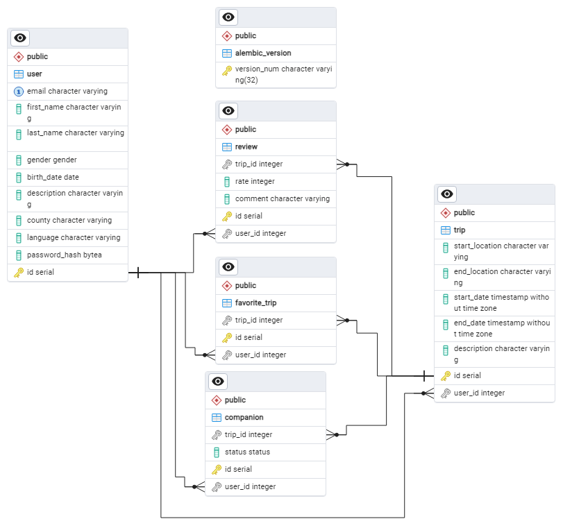

# Схема базы данных

## Описание

Данная схема предназначена для приложения, организующего путешествия и обмен отзывами о них. В ней учтены
пользователи, поездки, участники путешествия, избранные поездки и отзывы. Схема предусматривает хранение информации
о пользователях, их поездках, а также взаимодействие пользователей с этими поездками через систему отзывов и списка
избранных.

## Схема

## Модели

### Пользователи

Таблица `user` хранит информацию о пользователях приложения, включая их личные данные, такие как имя, фамилия, пол, дата
рождения, описание, страна и язык. Каждому пользователю присваивается уникальный ID, а также сохраняется хэш пароля для
аутентификации.

- **Поля**: email, first_name, last_name, gender, birth_date, description, county, language, password_hash
- **Уникальные индексы**: email
- **Основной ключ**: id

### Поездки

Таблица `trip` описывает поездки, созданные пользователями. Включает информацию о начальной и конечной точках, датах
начала и окончания поездки, описании и привязке к создавшему поездку пользователю.

- **Поля**: start_location, end_location, start_date, end_date, description, user_id
- **Внешние ключи**: user_id -> user(id)

### Компаньон

Таблица `companion` связывает пользователя и поездку, в которой он участвует в качестве сопутствующего. Содержит статус
участия и ссылки на соответствующего пользователя и поездку.

- **Поля**: trip_id, status, user_id
- **Внешние ключи**: trip_id -> trip(id), user_id -> user(id)

### Избранные поездки

Таблица `favorite_trip` отражает избранные поездки пользователей, позволяя сохранять интересные поездки для быстрого
доступа.

- **Поля**: trip_id, user_id
- **Внешние ключи**: trip_id -> trip(id), user_id -> user(id)

### Отзывы

Таблица `review` предназначена для хранения отзывов пользователей о поездках, включая оценку и комментарий.

- **Поля**: trip_id, rate, comment, user_id
- **Внешние ключи**: trip_id -> trip(id), user_id -> user(id)